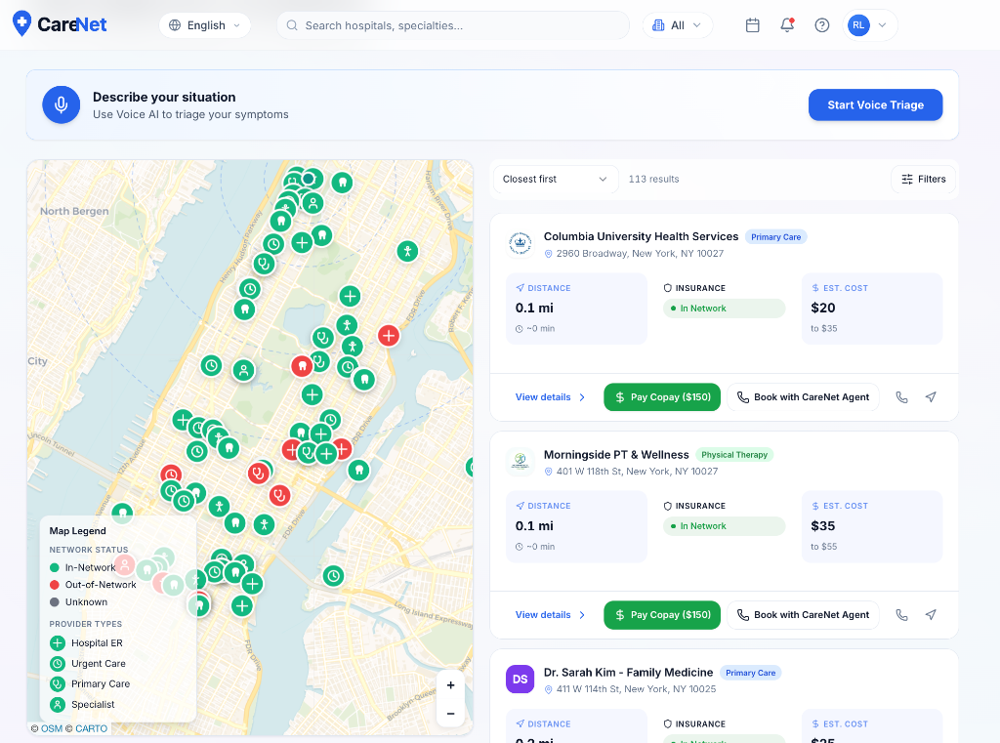
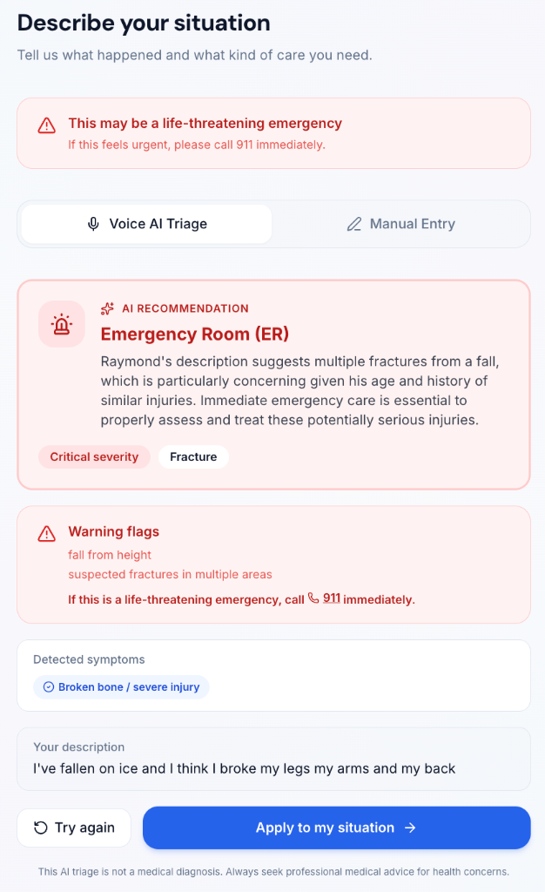
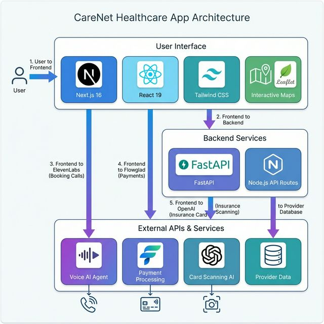

# 🏥 CareNet

**Find care you can afford, fast.**

CareNet is an AI-powered healthcare navigation platform that helps Americans find nearby medical facilities, understand their insurance coverage, and book appointments—all in seconds.

<p align="center">
  
</p>

---

## 🚨 The Problem

**Healthcare in America is broken—not because care doesn't exist, but because people can't find or afford it.**

- **32 million Americans** are uninsured, and millions more are underinsured
- **66% of bankruptcies** in the US are tied to medical bills
- **1 in 4 Americans** skip care due to cost concerns
- Emergency room visits average **$2,200** but can exceed **$20,000** for out-of-network facilities
- **Language barriers** prevent 25 million Americans from effectively navigating healthcare

When you're injured or sick, the last thing you should worry about is whether you can afford treatment—or if the hospital even accepts your insurance.

---

## 💡 Our Solution

CareNet puts healthcare transparency in your pocket:

### 🗺️ Real-Time Hospital Finder
See every emergency room, urgent care, dentist, and physical therapy clinic near you on an interactive map. Filter by facility type and see real-time distance and estimated travel time.

### 💰 Instant Cost Estimates
Before you walk in the door, know what you'll pay. CareNet shows whether a facility is **in-network** or **out-of-network** for your specific insurance plan, with estimated copays ranging from $100 to $3,500+.

### 📷 AI Insurance Card Scanner
Don't know your insurance details? Just snap a photo of your insurance card. Our AI extracts your provider, plan type, and member information in seconds—no manual entry required.

### 📞 Voice AI Booking Agent
Can't navigate phone trees? Our ElevenLabs-powered AI agent calls hospitals on your behalf to schedule appointments. Just tell it when you're available, and it handles the rest.

### 🌍 10+ Languages Supported
Healthcare shouldn't require English fluency. CareNet supports Spanish, Chinese, Russian, Bengali, Haitian Creole, Korean, Arabic, French, Urdu, and more.

### 💳 Integrated Payments
Pay your copay directly through the app with Flowglad-powered secure payment processing. No surprises at checkout.

---

## 🎯 Key Features

| Feature | Description |
|---------|-------------|
| **Interactive Map** | Leaflet-powered map showing 200+ NYC healthcare providers |
| **Smart Filtering** | Filter by emergency rooms, urgent care, dentists, or physical therapy |
| **Insurance Verification** | Real-time in-network/out-of-network status for major insurers |
| **Cost Transparency** | Estimated copays based on your specific plan |
| **AI Card Scanning** | OpenAI Vision extracts insurance info from card photos |
| **Voice Booking** | ElevenLabs AI agent makes appointment calls for you |
| **Multilingual** | Full UI translation in 10+ languages |
| **Calendar Integration** | Export appointments to Google Calendar or Apple Calendar |
| **Payment Processing** | Secure copay payments via Flowglad |

---

## 🛠️ How It Works

### 1. Tell Us About Your Emergency
Select your injury type (broken bone, chest pain, dental emergency, etc.) and severity level. CareNet uses this to recommend the right type of facility.



### 2. Scan Your Insurance Card
Take a photo of your insurance card or manually enter your information. Our AI identifies your provider (Anthem, Aetna, United, etc.) and plan type.

### 3. Find Nearby Facilities
See all matching facilities on the map, sorted by distance. Each card shows:
- Distance and estimated travel time
- In-network or out-of-network status
- Estimated cost range for your visit
- Available services and specialties

### 4. Book Your Appointment
Click "Book with CareNet Agent" and our AI voice agent will call the hospital to schedule your appointment. No hold times, no phone trees—just a confirmed booking.

### 5. Pay Your Copay
Pay your copay securely through the app before you arrive. No surprise bills.

---

## 🏗️ Tech Stack



| Layer | Technology |
|-------|------------|
| **Frontend** | Next.js 16, React 19, Tailwind CSS |
| **Backend** | FastAPI (Python) |
| **Maps** | Leaflet.js with OpenStreetMap |
| **AI Card Scanning** | OpenAI GPT-4 Vision |
| **Voice Agent** | ElevenLabs Conversational AI |
| **Payments** | Flowglad |
| **Database** | JSON (demo), designed for PostgreSQL |

---

## 🚀 Getting Started

### Prerequisites
- Node.js 18+
- Python 3.9+
- npm or pnpm

### Installation

```bash
# Clone the repository
git clone https://github.com/aaronmunford/CareNet.git
cd CareNet

# Install frontend dependencies
cd frontend
npm install

# Install backend dependencies
cd ../backend
pip install -r requirements.txt

# Start the backend
uvicorn main:app --reload --port 8000

# In another terminal, start the frontend
cd frontend
npm run dev
```

### Environment Variables

Create `frontend/.env.local`:
```
DEDALUS_API_KEY=your_openai_api_key
ELEVENLABS_API_KEY=your_elevenlabs_key
ELEVENLABS_AGENT_ID=your_agent_id
FLOWGLAD_SECRET_KEY=your_flowglad_key
```

---

## 🎬 Demo Scenario

**Meet Raymond, a 77-year-old resident of Harlem.**

Raymond slipped on ice and thinks he may have broken his arm. He's in pain and needs help fast.

1. **Opens CareNet** on his phone
2. **Scans his Anthem insurance card** with the camera
3. **Selects "Broken bone / severe injury"** as his emergency type
4. **Sees two nearby options:**
   - NYC Health + Hospitals/Harlem: 0.5 mi, Out of Network, ~$3,500
   - Mount Sinai Morningside: 0.6 mi, In Network, ~$150
5. **Clicks "Book with CareNet Agent"** on Mount Sinai
6. **The AI agent calls** and books his appointment for today
7. **Pays his $150 copay** through the app
8. **Gets directions** and arrives at Mount Sinai

**Result:** Raymond saved $3,350 and got faster care—all because he knew which hospital to choose.

---

## 👥 Team

Built with ❤️ at DevFest 2026

---

## 📄 License

MIT License - feel free to use this code to help make healthcare more accessible.

---

## 🙏 Acknowledgments

- **ElevenLabs** for conversational AI that books appointments
- **Flowglad** for seamless payment processing
- **OpenAI** for vision AI that reads insurance cards
- **OpenStreetMap** for mapping data
- All the healthcare workers who inspired this project

---

**CareNet: Because healthcare shouldn't be a guessing game.**
